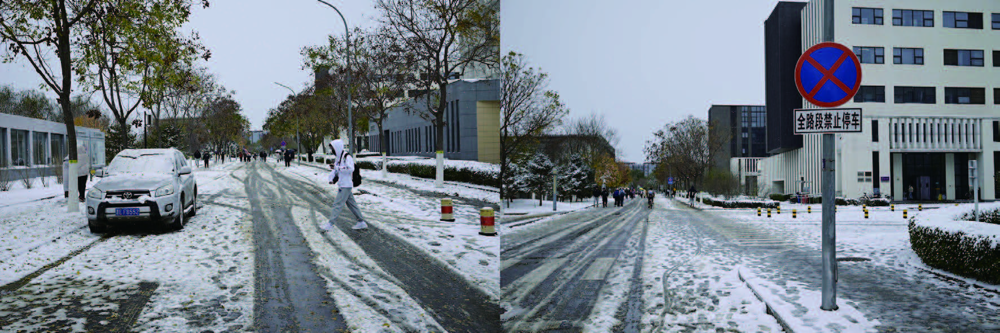
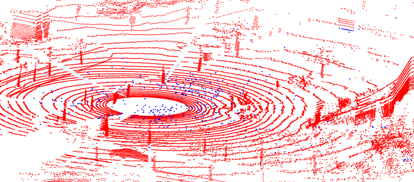
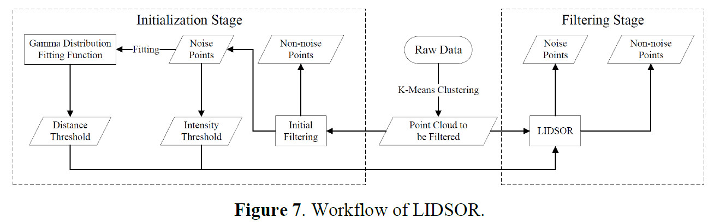
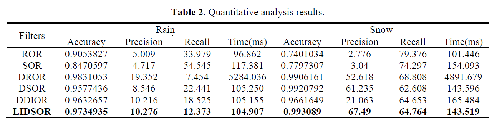

# LIDSOR: A Filter for Removing Rain and Snow Noise Points from LIDAR Point Clouds in Rainy and Snowy Weather

### [Paper](https://isprs-archives.copernicus.org/articles/XLVIII-1-W2-2023/733/2023/)

> LIDSOR: A Filter for Removing Rain and Snow Noise Points from LIDAR Point Clouds in Rainy and Snowy Weather

> He Huang, [Xinyuan Yan](https://naclzno.github.io/Xinyuan-Yan/), Junxing Yang $\ddagger$, Yuming Cao $\dagger$, and Xin Zhang

$\dagger$ Project leader $\ddagger$ Corresponding author

## Highlights

- **We performed a comprehensive statistical analysis on the intensity and spatial distribution characteristics of noise points generated in rain and snow, subsequently employing gamma curves for a more precise fitting of these noise point distribution characteristics.**
- **We propose a LIDSOR filter. This filter is built on intensity and distance thresholds.**


## Data Acquisition and Label

### Platform


### Camera



### Rosbag Package

<p align="center">
    
</p>

### Point-wise Label

<p align="center">
    
</p>

## Abstract

As autonomous driving technology advances, ensuring the system's safety in rain and snow has emerged as a pivotal research topic. In rainy and snowy weather, rain and snow can generate noise points within the point cloud captured by the Light Detection and Ranging (LiDAR), significantly impeding the LiDAR's sensing capability. To address this problem, we first manually label the point cloud data gathered in rain and snow, categorizing all points into noise points and non-noise points. Subsequently, we analyze the intensity and spatial distribution characteristics of the rain and snow noise points and employ the gamma distribution curve to illustrate the spatial distribution characteristics of these noise points. Finally, we propose a Low-Intensity Dynamic Statistical Outlier Removal (LIDSOR) filter, an enhancement of the existing Dynamic Statistical Outlier Removal (DSOR) filter. Experimental results suggest that the LIDSOR filter can effectively eliminate rain and snow noise points while preserving more environmental feature points. Additionally, it consumes fewer computational resources. The filter we propose in this paper significantly contributes to the safe operation of the autonomous driving system in diverse complex environments.



## Quantitative Results




## How to build & Run

------

   ```
   $ cd lidsor && mkdir build && cd build
   $ cmake ..
   $ make -j 16
   ```

## When will we publish the source code?

The source code for the Low-Intensity Dynamic Statistical Outlier Removal (LIDSOR) filter is scheduled to be published by 2025. We kindly ask for your patience.


## Citation

If you find this project helpful, please consider citing the following paper:
```
@article{huang2023lidsor,
  title={LIDSOR: A filter for removing rain and snow noise points from LiDAR point clouds in rainy and snowy weather},
  author={Huang, He and Yan, Xinyuan and Yang, Junxing and Cao, Yuming and Zhang, Xin},
  journal={The International Archives of the Photogrammetry, Remote Sensing and Spatial Information Sciences},
  volume={48},
  pages={733--740},
  year={2023},
  publisher={Copernicus GmbH}
}
```

